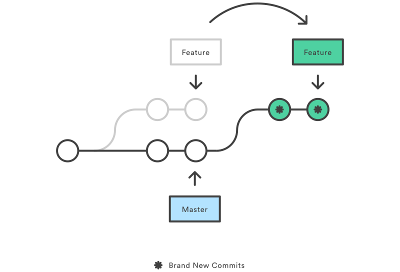

# Git and Github {#git}

The what and why of version control (specific to R!) can be found [here](https://happygitwithr.com/)


## Git in RStudio

There is a "git" tab in RStudio, but it can't perform simple operations required to develop a project from a fork, so you likely want to start using the terminal for all of your git needs. If you are a visual person,  there are many flavors of git guis for download( (which can be found [here](https://git-scm.com/downloads/guis)) that have graphical history viewers that show color coded history trees. 

```{r, echo=FALSE, fig.cap="Gitk's interface [@gitk]"}
knitr::include_graphics("images/gitk.png")
```

Gitk (shown above) and git-gui come with a standard Git install. If you wish to make a commit with a gui, use the command `git gui` and if you wish to view the history tree, execute `gitk --all` in your terminal.


### Setting Up Remotes for the First Time
Create a fork on GitHub. A **fork** is a static copy of someone else's Github repository. A **remote** repository is the version that is stored on a GitHub server (as opposed to your personal laptop or *local* machine), and is the version available for viewing on github.com. An **upstream** repository is the shared version of the project that you are contributing to.

```bash
# create a local copy (clone) of your fork
git clone https://github.rcac.purdue.edu/<YOUR_USERNAME>/SuperPower.git
# remote origin is your own personal fork as it lives on GitHub
git remote set-url origin https://github.rcac.purdue.edu/<YOUR_USERNAME>/SuperPower.git
# remote upstream is the parent repository as it lives on GitHub
git remote set-url upstream https://github.rcac.purdue.edu/ScientificSolutions/SuperPower.git
# list remotes
git remote -v

```

## Git Workflow from a Fork

Inspired by \@Chaser324's [Gist](https://gist.github.com/Chaser324/ce0505fbed06b947d962).

### Merge upstream changes into your own master branch
```bash
# Fetch from upstream remote
git fetch upstream

# Checkout your master branch and merge upstream
git checkout master
git merge upstream/master
```

### Create a branch to work on a new feature or bugfix
```bash
# Checkout the master branch - you want your new branch to come from master
git checkout master

# Create a new branch named newfeature (give your branch its own simple informative name)
git branch newfeature

# Switch to your new branch
git checkout newfeature
```

### [Rebase](https://www.atlassian.com/git/tutorials/rewriting-history/git-rebase) your feature branch commits to the front of your master branch

```{r, echo=FALSE, fig.cap="Rebase of feature branch [@rebase]"}

```

```bash
# Rebase your development branch
git checkout newfeature
git rebase master
```

### Push changes to GitHub and create pull request


